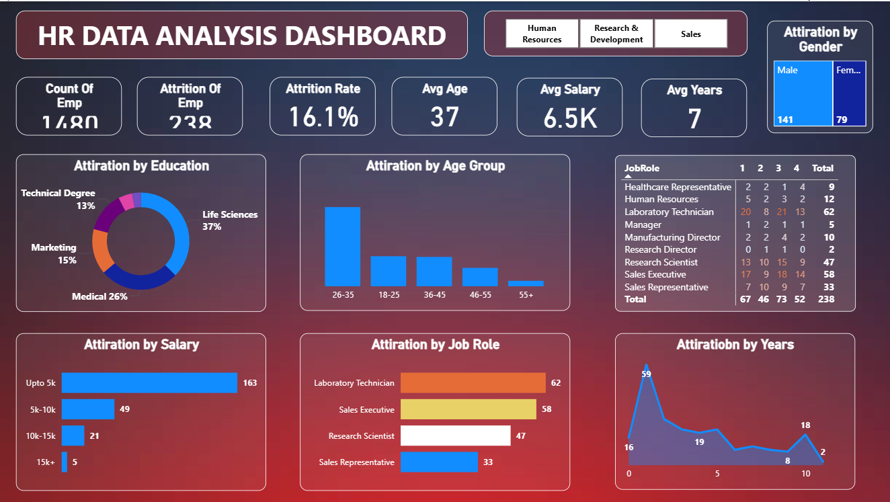

# 📊 HR Data Analysis Dashboard

## 🔍 Project Overview

This project focuses on analyzing employee attrition using a data-driven dashboard.
The goal is to identify key factors affecting employee turnover and provide actionable insights.

---

## 📊 Key Metrics

* 👥 Total Employees: 1480
* 📉 Attrition Count: 238
* 📊 Attrition Rate: 16.1%
* 🎂 Average Age: 37
* 💰 Average Salary: 6.5K
* ⏳ Average Experience: 7 Years

---

## 📈 Key Insights

* 🔹 Highest attrition observed in employees with salary up to 5k
* 🔹 Employees from Life Sciences background show highest attrition
* 🔹 Sales Executive & Laboratory Technician roles have higher attrition
* 🔹 Age group 26–35 shows maximum employee turnover
* 🔹 Early years of experience show higher attrition trends

---

## 🛠 Tools & Technologies Used

* SQL (Data Extraction & Analysis)
* Power BI / Excel (Dashboard Creation)
* Data Visualization Techniques

---

## 📷 Dashboard Preview

---

## 🎯 Project Objective

To analyze HR data and uncover patterns behind employee attrition, helping organizations take data-driven decisions to improve retention.

---

## 🚀 Future Improvements

* Add predictive analysis using Machine Learning
* Automate data pipeline
* Deploy dashboard online

---

## 👨‍💻 Author

Rahul Verma

---

💡 This project is part of my journey to become a Data Analyst.
